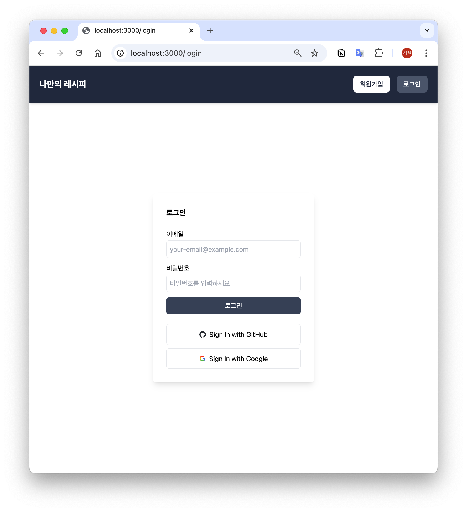

# <span id="top">🧑‍🍳 레시피북</span>

<br>

## <span>📍 목차 </span>

[📜 프로젝트 소개](#intro)<br>
[⚙️ 개발 기술](#development)<br>
[🖥️ 주요 기능](#main-feature)<br>
[🏞️ 구현 기능 사진](#feature-img)<br>
[📂 프로젝트 구조](#structure)<br>
[🛠 실행](#run-deploy)<br>

---

<br>

## <span id="intro">📜 프로젝트 소개</span>

### [ 개요 ]

- 레시피북은 레시피를 저장할 수 있는 웹 사이트입니다.
- 저장한 레시피의 목록을 볼 수 있습니다.
- 회원가입 또는 구글/깃허브 계정으로 로그인하고 나만의 레시피 리스트를 만들 수 있습니다.
- 조리 과정에 따라 타이머를 설정할 수 있습니다.
- 레시피의 버전을 설정하여 이전 버전을 확인할 수 있습니다.

<br>

### [ 제작 기간 ]

(2024.10.14 - 2024.10.16)

<p align="right"><a href="#top">⬆️Top</a></p>

---

<br>

## <span id="development">⚙️ 개발 기술</span>

Next.js 14

<p align="right"><a href="#top">⬆️Top</a></p>

---

<br>

## <span id="main-feature">🖥️ 주요 기능</span>

### [👤 유저 인증]

- 회원가입을 하여 로그인을 할 수 있습니다.
- 구글 또는 깃허브를 이용하여 빠르게 로그인을 할 수 있습니다.

### [📜 레시피 목록]

- 레시피 목록에서 레시피 제목과 태그를 확인할 수 있습니다.
- `자세히 보기` 버튼을 통해 상세 레시피를 확인할 수 있습니다.

### [🧾 자세히 보기]

- 조리 과정에 따라 `타이머`를 설정해서 알림을 받을 수 있습니다.
- 태그, 재료 목록, 조리 과정을 확인할 수 있습니다.
- 수정 기록을 통해 `이전 버전으로 복원` 기능을 사용할 수 있습니다.
- 레시피 수정, 삭제가 가능합니다.

<p align="right"><a href="#top">⬆️Top</a></p>

---

<br>

## <span id="feature-img">🏞️ 구현 기능 사진</span>

| <center>로그인</center>                            | <center>레시피 목록</center>                            | <center>자세히 보기</center>                            |
| -------------------------------------------------- | ------------------------------------------------------- | ------------------------------------------------------- |
|  |  |  |

<p align="right"><a href="#top">⬆️Top</a></p>

---

<br>

## <span id="structure">📂 프로젝트 구조</span>

```
📦src
 ┣ 📂app
 ┃ ┣ 📂api
 ┃ ┃ ┗ 📂auth
 ┃ ┃ ┃ ┗ 📂[...nextauth]
 ┃ ┃ ┃ ┃ ┗ 📜route.tsx
 ┃ ┣ 📂add
 ┃ ┃ ┣ 📜page.tsx
 ┃ ┣ 📂detail
 ┃ ┃ ┣ 📜page.tsx
 ┃ ┣ 📂edit
 ┃ ┃ ┣ 📜page.tsx
 ┃ ┣ 📂login
 ┃ ┃ ┣ 📜page.tsx
 ┃ ┣ 📂register
 ┃ ┃ ┣ 📜page.tsx
 ┃ ┣ 📜favicon.ico
 ┃ ┣ 📜globals.css
 ┃ ┣ 📜layout.tsx
 ┃ ┣ 📜page.tsx
 ┣ 📂components
 ┃ ┣ 📜AuthForm.tsx
 ┃ ┣ 📜Header.tsx
 ┃ ┣ 📜InputField.tsx
 ┃ ┣ 📜LoginPrompt.tsx
 ┃ ┣ 📜OauthButton.tsx
 ┃ ┣ 📜RecipeList.tsx
 ┃ ┣ 📜Timer.tsx
 ┣ 📂utils
 ┃ ┣ 📜recipeStorage.tsx
 ┃ ┣ 📜userStorage.tsx

```

<p align="right"><a href="#top">⬆️Top</a></p>

---

<br>

## <span id="run-deploy">🛠 실행</span>

- 이 폴더를 `VSCode`에서 열기
- `터미널` -> `새 터미널`을 선택
- `npm i` 실행
- 이 폴더에 `.env.local` 파일 생성
- .env 파일에 아래의 5가지 `환경 변수`를 작성

  ```dosini
    AUTH_SECRET=
    AUTH_GITHUB_ID=
    AUTH_GITHUB_SECRET=
    AUTH_GOOGLE_ID=
    AUTH_GOOGLE_SECRET=

  ```

- `npm run dev` 실행.
- `localhost:3000`에 접속하여 확인

<p align="right"><a href="#top">⬆️Top</a></p>

---

<br>
